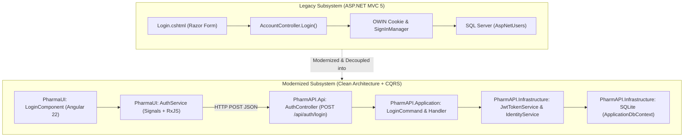

# Modernization Analysis: Work Item #98

**Work Item**: [Step 01 - US-SEC-01: User Login, JWT/Cookie Session & Lockout Protection](https://dev.azure.com/balajinaik/5976a5b1-4d57-4ed1-870d-4370825e9b67/_workitems/edit/98)  
**Epic**: `EPIC 1: Security, Identity & User Access`  
**Lifecycle Stage**: `ANALYZE (Hard Gate #1)`  

---

## 1. Executive Summary & Legacy Decomposition

The legacy authentication subsystem in `FYPPharmAssistant` relies on ASP.NET Identity 2.2 and OWIN cookie-based session management coupled directly to ASP.NET MVC Razor views. 

This analysis decomposes the legacy login workflow, identifies business rules and security behaviors, and maps them to a modern **Clean Architecture + CQRS (MediatR)** backend with **SQLite EF Core** and an **Angular 22 Standalone** frontend.



---

## 2. Deep Legacy Behavioral Analysis

### 2.1 Functional Workflows & Invariants

1. **Credential Validation & Sanitization**:
   - Legacy: `LoginViewModel` validated required `Email` and `Password` attributes.
   - Modern: `LoginCommandValidator` validates inputs using `FluentValidation` before reaching the command handler.

2. **Account Lockout Policy**:
   - Legacy: `IdentityConfig.cs` configured `MaxFailedAccessAttemptsBeforeLockout = 5` and a 5-minute lockout.
   - Modern: Acceptance Criteria enforce **5 consecutive failed attempts triggering a 15-minute account lockout**. Failed attempts increment `AccessFailedCount`; upon reaching 5, `LockoutEnd` is set to `DateTimeOffset.UtcNow.AddMinutes(15)`.

3. **Information Disclosure Prevention**:
   - Legacy: Catch-all exception block returned generic `"Invalid login attempt."`
   - Modern: Returns `HTTP 401 Unauthorized` with generic message `"Invalid email or password"` without distinguishing between non-existent emails and wrong passwords. If locked, returns `HTTP 423 Locked` with remaining lockout duration.

4. **Role-Based Navigation & Session Invariants**:
   - Legacy: `roles[0] == "Staff"` redirected to `SalesEntry/Index`, while Admin redirected to `returnUrl`.
   - Modern: Backend returns `roles` array and `defaultRedirectUrl` in `LoginResponseDto`. Angular `AuthService` dynamically directs `Staff` to `/sales` (POS Billing) and `Admin` to `/dashboard`.

5. **Session Persistence ("Remember Me")**:
   - Legacy: Cookie persistence set via OWIN `isPersistent: model.RememberMe`.
   - Modern: Frontend retains JWT token in `localStorage` if `rememberMe = true`, or `sessionStorage` if `false`.

---

## 3. Database Schema & Migration Specification

### 3.1 Entity Model Mapping (SQLite EF Core)

| Legacy Entity / Table | Modern Entity / Table | Migration Strategy | Key Attributes & Constraints |
| :--- | :--- | :--- | :--- |
| `AspNetUsers` | `ApplicationUser` (`AspNetUsers`) | **TRANSFORMED_TO** | `Id` (GUID/String PK), `Email` (Unique, Index), `PasswordHash`, `LockoutEnd`, `AccessFailedCount`, `FullName`, `ContactNo`, `Address`, `IsActive` |
| `AspNetRoles` | `ApplicationRole` (`AspNetRoles`) | **PRESERVED_AS** | `Id`, `Name` (`Admin`, `Staff`), `NormalizedName` |
| `AspNetUserRoles` | `IdentityUserRole<string>` | **PRESERVED_AS** | `UserId`, `RoleId` (Composite PK) |
| `AspNetUserClaims` | `IdentityUserClaim<string>` | **PRESERVED_AS** | `Id`, `UserId`, `ClaimType`, `ClaimValue` |

---

## 4. Target Architecture & API Contract Specification

### 4.1 REST API Endpoint: `POST /api/auth/login`

**Request Payload (`LoginCommand`)**:
```json
{
  "email": "pharmacist@pharmassistant.com",
  "password": "SecurePassword123!",
  "rememberMe": true
}
```

**Success Response (`200 OK`)**:
```json
{
  "token": "eyJhbGciOiJIUzI1NiIsInR5cCI6IkpXVCJ9...",
  "expiration": "2026-09-24T10:30:00Z",
  "email": "pharmacist@pharmassistant.com",
  "fullName": "Jane Doe",
  "roles": ["Staff"],
  "defaultRedirectUrl": "/sales"
}
```

**Error Responses**:
- `400 Bad Request`: Validation failure (empty email, invalid format).
- `401 Unauthorized`: Invalid credentials.
- `423 Locked`: Account temporarily locked due to repeated failed attempts.

### 4.2 CQRS & Clean Architecture Layer Breakdown

- **Domain (`PharmAPI.Domain`)**:
  - `ApplicationUser`: Extends `IdentityUser` with pharmacy staff metadata.
  - `ApplicationRole`: Core system roles.
- **Application (`PharmAPI.Application`)**:
  - `LoginCommand`: Input record.
  - `LoginCommandHandler`: Orchestrates authentication via `IIdentityService` and token generation via `IJwtTokenService`.
  - `LoginCommandValidator`: FluentValidation rules.
  - `LoginResponseDto`: Data transfer object.
  - `IJwtTokenService`, `IIdentityService`: Domain abstractions.
- **Infrastructure (`PharmAPI.Infrastructure`)**:
  - `ApplicationDbContext`: SQLite EF Core database context.
  - `IdentityService`: ASP.NET Core Identity adapter with 15-min lockout enforcement.
  - `JwtTokenService`: Signs JWT with HMAC-SHA256 using configured secret key.
- **Presentation (`PharmAPI.Api` & `PharmaUI`)**:
  - `AuthController`: Minimalist controller delegating directly to MediatR.
  - `LoginComponent`: Angular 22 standalone component with responsive UI, reactive forms, error alerts, and remember-me support.
  - `AuthService`: Signals-based reactive auth state management.

---

## 5. Risk Assessment & Mitigations

| Risk | Impact | Mitigation Strategy |
| :--- | :--- | :--- |
| **Token Hijacking (XSS)** | High | Short JWT lifespan (60 mins), optional refresh token flow, HTTPS enforcement. |
| **Brute Force Attacks** | Medium | Automated account lockout after 5 consecutive failures for 15 minutes. |
| **Database Concurrency in SQLite** | Low | Enable WAL (Write-Ahead Logging) mode and connection pooling in EF Core SQLite options. |
