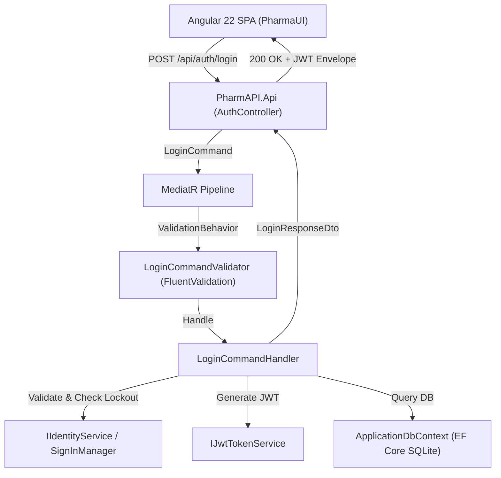

# Modernization Bounded Context: Work Item #98

**Work Item**: [Step 01 - US-SEC-01: User Login, JWT/Cookie Session & Lockout Protection](https://dev.azure.com/balajinaik/5976a5b1-4d57-4ed1-870d-4370825e9b67/_workitems/edit/98)  
**Epic**: `EPIC 1: Security, Identity & User Access`  
**Priority**: `1` (Critical)  
**Status**: `CONTEXT_READY`  

---

## 1. Executive Summary & Objective

Modernize legacy monolithic ASP.NET Identity 2.2 session-based login from [`AccountController.cs`](file:///D:/PharmAssistant/PharmAssistant/FYPPharmAssistant/Controllers/Account/AccountController.cs) and Razor View [`Login.cshtml`](file:///D:/PharmAssistant/PharmAssistant/FYPPharmAssistant/Views/Account/Login.cshtml) into a decoupled, secure **ASP.NET Core 7.0 Web API** using the **CQRS pattern** with **MediatR** and an **Angular 22** reactive login interface with JWT authentication.

---

## 2. Legacy Source Slice (`READ_ONLY`)

### 2.1 Key Legacy Artifacts
- **Controller**: [`FYPPharmAssistant/Controllers/Account/AccountController.cs`](file:///D:/PharmAssistant/PharmAssistant/FYPPharmAssistant/Controllers/Account/AccountController.cs#L66-L125) (`Login` action)
- **View Models**: [`FYPPharmAssistant/Models/Account/AccountViewModels.cs`](file:///D:/PharmAssistant/PharmAssistant/FYPPharmAssistant/Models/Account/AccountViewModels.cs#L46-L60) (`LoginViewModel`)
- **Domain & DB Context**: [`FYPPharmAssistant/Models/Account/IdentityModels.cs`](file:///D:/PharmAssistant/PharmAssistant/FYPPharmAssistant/Models/Account/IdentityModels.cs#L10-L44) (`ApplicationUser`, `ApplicationDbContext`)
- **Identity Config**: [`FYPPharmAssistant/App_Start/IdentityConfig.cs`](file:///D:/PharmAssistant/PharmAssistant/FYPPharmAssistant/App_Start/IdentityConfig.cs#L21-L71) (`ApplicationUserManager` lockout policy: 5 attempts / 5-min lockout)
- **UI Template**: [`FYPPharmAssistant/Views/Account/Login.cshtml`](file:///D:/PharmAssistant/PharmAssistant/FYPPharmAssistant/Views/Account/Login.cshtml)

### 2.2 Observed Legacy Behaviors & Rules
1. **Authentication Mode**: Form POST with `Email`, `Password`, and `RememberMe`.
2. **Lockout Policy**: In legacy configuration, lockout defaults were defined as `MaxFailedAccessAttemptsBeforeLockout = 5` and `DefaultAccountLockoutTimeSpan = 5 minutes`. For modernization, acceptance criteria mandate 15 minutes lockout.
3. **Role-Based Redirect**:
   - `Staff` role redirected to `SalesEntry` / POS billing.
   - `Admin` role redirected to `Home` dashboard or `returnUrl`.
4. **Email Confirmation**: Legacy enforced `UserManager.IsEmailConfirmed(userid)` before granting login.

---

## 3. Target Modernization Slice (`READ_WRITE`)

### 3.1 Backend Architecture ([PharmAPI](file:///D:/PharmAssistant/ModrenPharmAssistant/PharmAPI))

- **Domain Layer (`PharmAPI.Domain`)**:
  - `User` entity extending ASP.NET Core Identity (`IdentityUser`) with `FullName`, `ContactNo`, `Address`.
  - `Role` entity (`Admin`, `Staff`).
- **Application Layer (`PharmAPI.Application`)**:
  - `LoginCommand(string Email, string Password, bool RememberMe)` : `IRequest<LoginResponseDto>`
  - `LoginCommandHandler` : `IRequestHandler<LoginCommand, LoginResponseDto>`
  - `LoginCommandValidator` : `AbstractValidator<LoginCommand>`
  - `LoginResponseDto` : `{ Token, Expiration, Email, FullName, Roles, RequiresTwoFactor }`
  - Interfaces: `IIdentityService`, `IJwtTokenService`.
- **Infrastructure Layer (`PharmAPI.Infrastructure`)**:
  - `IdentityService` implementing password verification, lockout tracking, and claim extraction.
  - `JwtTokenService` generating HMAC-SHA256 signed tokens with custom claims.
  - EF Core SQLite `ApplicationDbContext` with SQLite connection provider.
- **API Layer (`PharmAPI.Api`)**:
  - `AuthController` exposing `[HttpPost("login")]` with Swagger documentation and OpenAPI response attributes.

### 3.2 Frontend Architecture ([PharmaUI](file:///D:/PharmAssistant/ModrenPharmAssistant/PharmaUI))

- **Models**: `AuthRequest`, `AuthResponse`, `CurrentUser` interfaces.
- **Services**: `AuthService` managing JWT tokens in `sessionStorage`/`localStorage`, Signal-based authentication state (`currentUser()`, `isAuthenticated()`, `userRoles()`).
- **Guards & Interceptors**: `authGuard`, `jwtInterceptor` attaching Bearer header.
- **Components**: `LoginComponent` (Standalone Angular 22 component) with reactive form, validation messages, loading spinner, and role-based redirect.

---

## 4. Acceptance Criteria & Verification Matrix

| # | Acceptance Criteria | Legacy Parity | Modern Verification Method |
| :--- | :--- | :--- | :--- |
| **AC-1** | Valid credentials authenticate and return secure JWT token with user claims & roles | `AccountController.Login` (Success) | Integration test `POST /api/auth/login` returns HTTP 200 + valid JWT payload |
| **AC-2** | 5 consecutive failed login attempts trigger 15-minute account lockout | `IdentityConfig.cs` Lockout | Unit/Integration test asserting HTTP 423 / Lockout message on 6th attempt |
| **AC-3** | Invalid credentials return generic error without user enumeration | `AccountController` Failure | Assert generic "Invalid email or password" error message |
| **AC-4** | 'Remember Me' sets persistent session storage | `RememberMe` flag | AuthService sets `localStorage` vs `sessionStorage` |
| **AC-5** | Role-based navigation on login (`Staff` -> POS, `Admin` -> Dashboard) | `AccountController` Role routing | Angular router navigation test |

---

## 5. Technology Practice Constraints & Blast Radius

- **Security**: Never store plaintext passwords; rely on Argon2/PBKDF2 via ASP.NET Core Identity. Never expose stack traces or detailed credential failure reasons.
- **CQRS**: `LoginCommand` performs mutation (updating access failed count, lockout end date, last login timestamp) and returns `LoginResponseDto`.
- **EF Core SQLite**: SQLite provider requires PRAGMA foreign keys enabled.
- **Clean Architecture**: `PharmAPI.Application` has zero dependencies on ASP.NET Core MVC / Web API assemblies.
