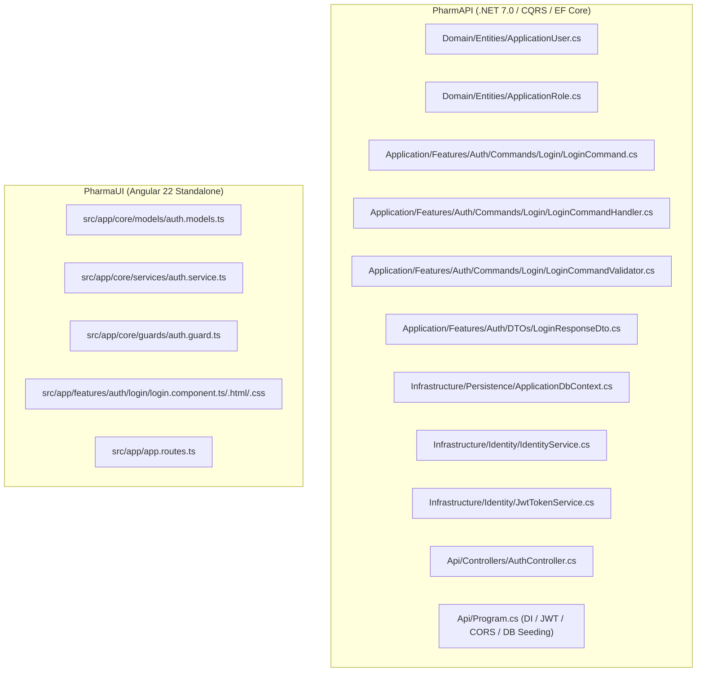

# Modernization Implementation Plan: Work Item #98

**Work Item**: [Step 01 - US-SEC-01: User Login, JWT/Cookie Session & Lockout Protection](https://dev.azure.com/balajinaik/5976a5b1-4d57-4ed1-870d-4370825e9b67/_workitems/edit/98)  
**Epic**: `EPIC 1: Security, Identity & User Access`  
**Lifecycle Stage**: `PLAN (Hard Gate #2)`  

---

## 1. Architectural File Execution Map



---

## 2. File-by-File Task Decomposition

### Phase A: Target Backend Packages & Domain Layer (`PharmAPI.Domain`)

1. **Package Configuration**:
   - `PharmAPI.Domain.csproj`: Reference `Microsoft.AspNetCore.Identity.EntityFrameworkCore` (7.0.x).
   - `PharmAPI.Application.csproj`: Reference `FluentValidation` & `FluentValidation.DependencyInjectionExtensions`.
   - `PharmAPI.Infrastructure.csproj`: Reference `Microsoft.EntityFrameworkCore.Sqlite`, `Microsoft.AspNetCore.Authentication.JwtBearer`, `System.IdentityModel.Tokens.Jwt`.
   - `PharmAPI.Api.csproj`: Reference `Microsoft.AspNetCore.Authentication.JwtBearer`.

2. **File Creations & Modifications**:
   - `CREATE`: [`PharmAPI/PharmAPI.Domain/Entities/ApplicationUser.cs`](file:///D:/PharmAssistant/ModrenPharmAssistant/PharmAPI/PharmAPI.Domain/Entities/ApplicationUser.cs)
     - Inherits `IdentityUser`. Properties: `FullName`, `ContactNo`, `Address`, `IsActive`, `CreatedAt`.
   - `CREATE`: [`PharmAPI/PharmAPI.Domain/Entities/ApplicationRole.cs`](file:///D:/PharmAssistant/ModrenPharmAssistant/PharmAPI/PharmAPI.Domain/Entities/ApplicationRole.cs)
     - Inherits `IdentityRole`.
   - `DELETE`: [`PharmAPI/PharmAPI.Domain/Class1.cs`](file:///D:/PharmAssistant/ModrenPharmAssistant/PharmAPI/PharmAPI.Domain/Class1.cs)

---

### Phase B: Application Layer (`PharmAPI.Application`)

3. **Abstractions & DTOs**:
   - `CREATE`: [`PharmAPI/PharmAPI.Application/Common/Interfaces/IIdentityService.cs`](file:///D:/PharmAssistant/ModrenPharmAssistant/PharmAPI/PharmAPI.Application/Common/Interfaces/IIdentityService.cs)
     - `Task<(bool Success, string Error, ApplicationUser User, IList<string> Roles)> AuthenticateAsync(string email, string password, bool rememberMe, CancellationToken cancellationToken);`
   - `CREATE`: [`PharmAPI/PharmAPI.Application/Common/Interfaces/IJwtTokenService.cs`](file:///D:/PharmAssistant/ModrenPharmAssistant/PharmAPI/PharmAPI.Application/Common/Interfaces/IJwtTokenService.cs)
     - `string GenerateToken(ApplicationUser user, IList<string> roles, out DateTime expiration);`
   - `CREATE`: [`PharmAPI/PharmAPI.Application/Features/Auth/DTOs/LoginResponseDto.cs`](file:///D:/PharmAssistant/ModrenPharmAssistant/PharmAPI/PharmAPI.Application/Features/Auth/DTOs/LoginResponseDto.cs)
     - Records: `Token`, `Expiration`, `Email`, `FullName`, `Roles`, `DefaultRedirectUrl`.

4. **CQRS Command, Validator & Handler**:
   - `CREATE`: [`PharmAPI/PharmAPI.Application/Features/Auth/Commands/Login/LoginCommand.cs`](file:///D:/PharmAssistant/ModrenPharmAssistant/PharmAPI/PharmAPI.Application/Features/Auth/Commands/Login/LoginCommand.cs)
     - `public record LoginCommand(string Email, string Password, bool RememberMe) : IRequest<LoginResponseDto>;`
   - `CREATE`: [`PharmAPI/PharmAPI.Application/Features/Auth/Commands/Login/LoginCommandValidator.cs`](file:///D:/PharmAssistant/ModrenPharmAssistant/PharmAPI/PharmAPI.Application/Features/Auth/Commands/Login/LoginCommandValidator.cs)
     - Validates non-empty email, valid email structure, non-empty password.
   - `CREATE`: [`PharmAPI/PharmAPI.Application/Features/Auth/Commands/Login/LoginCommandHandler.cs`](file:///D:/PharmAssistant/ModrenPharmAssistant/PharmAPI/PharmAPI.Application/Features/Auth/Commands/Login/LoginCommandHandler.cs)
     - Executes authentication, checks lockout status, handles role routing (`Staff` -> `/sales`, `Admin` -> `/dashboard`), and returns signed JWT response.
   - `CREATE`: [`PharmAPI/PharmAPI.Application/DependencyInjection.cs`](file:///D:/PharmAssistant/ModrenPharmAssistant/PharmAPI/PharmAPI.Application/DependencyInjection.cs)
   - `DELETE`: [`PharmAPI/PharmAPI.Application/Class1.cs`](file:///D:/PharmAssistant/ModrenPharmAssistant/PharmAPI/PharmAPI.Application/Class1.cs)

---

### Phase C: Infrastructure Layer (`PharmAPI.Infrastructure`)

5. **Persistence & Identity Services**:
   - `CREATE`: [`PharmAPI/PharmAPI.Infrastructure/Persistence/ApplicationDbContext.cs`](file:///D:/PharmAssistant/ModrenPharmAssistant/PharmAPI/PharmAPI.Infrastructure/Persistence/ApplicationDbContext.cs)
     - Extends `IdentityDbContext<ApplicationUser, ApplicationRole, string>`. Configures SQLite options.
   - `CREATE`: [`PharmAPI/PharmAPI.Infrastructure/Persistence/ApplicationDbContextSeed.cs`](file:///D:/PharmAssistant/ModrenPharmAssistant/PharmAPI/PharmAPI.Infrastructure/Persistence/ApplicationDbContextSeed.cs)
     - Seeds initial roles (`Admin`, `Staff`) and default admin user (`admin@pharmassistant.com` / `Admin@123`).
   - `CREATE`: [`PharmAPI/PharmAPI.Infrastructure/Identity/IdentityService.cs`](file:///D:/PharmAssistant/ModrenPharmAssistant/PharmAPI/PharmAPI.Infrastructure/Identity/IdentityService.cs)
     - Implements `IIdentityService`. Enforces 5-attempt limit and 15-minute lockout (`LockoutEnd = UtcNow.AddMinutes(15)`).
   - `CREATE`: [`PharmAPI/PharmAPI.Infrastructure/Identity/JwtTokenService.cs`](file:///D:/PharmAssistant/ModrenPharmAssistant/PharmAPI/PharmAPI.Infrastructure/Identity/JwtTokenService.cs)
     - Implements `IJwtTokenService` with HMAC-SHA256 token generation.
   - `CREATE`: [`PharmAPI/PharmAPI.Infrastructure/DependencyInjection.cs`](file:///D:/PharmAssistant/ModrenPharmAssistant/PharmAPI/PharmAPI.Infrastructure/DependencyInjection.cs)
   - `DELETE`: [`PharmAPI/PharmAPI.Infrastructure/Class1.cs`](file:///D:/PharmAssistant/ModrenPharmAssistant/PharmAPI/PharmAPI.Infrastructure/Class1.cs)

---

### Phase D: API Layer (`PharmAPI.Api`)

6. **Endpoints & Startup Registration**:
   - `CREATE`: [`PharmAPI/PharmAPI.Api/Controllers/ApiControllerBase.cs`](file:///D:/PharmAssistant/ModrenPharmAssistant/PharmAPI/PharmAPI.Api/Controllers/ApiControllerBase.cs)
   - `CREATE`: [`PharmAPI/PharmAPI.Api/Controllers/AuthController.cs`](file:///D:/PharmAssistant/ModrenPharmAssistant/PharmAPI/PharmAPI.Api/Controllers/AuthController.cs)
     - Exposes `[HttpPost("login")]` delegating to MediatR pipeline.
   - `MODIFY`: [`PharmAPI/PharmAPI.Api/appsettings.json`](file:///D:/PharmAssistant/ModrenPharmAssistant/PharmAPI/PharmAPI.Api/appsettings.json)
     - Configures `ConnectionStrings:DefaultConnection = "Data Source=pharmassistant.db"` and `JwtSettings: { Secret, Issuer, Audience, ExpiryInMinutes }`.
   - `MODIFY`: [`PharmAPI/PharmAPI.Api/Program.cs`](file:///D:/PharmAssistant/ModrenPharmAssistant/PharmAPI/PharmAPI.Api/Program.cs)
     - Wires up DI layers, ASP.NET Core Identity, JWT Bearer Authentication, Swagger UI with Bearer security scheme, and seeds database on startup.
   - `DELETE`: [`PharmAPI/PharmAPI.Api/WeatherForecast.cs`](file:///D:/PharmAssistant/ModrenPharmAssistant/PharmAPI/PharmAPI.Api/WeatherForecast.cs) & [`Controllers/WeatherForecastController.cs`](file:///D:/PharmAssistant/ModrenPharmAssistant/PharmAPI/PharmAPI.Api/Controllers/WeatherForecastController.cs).

---

### Phase E: Frontend Layer (`PharmaUI`)

7. **Auth Service, Guards & Interceptor**:
   - `CREATE`: [`PharmaUI/src/app/core/models/auth.models.ts`](file:///D:/PharmAssistant/ModrenPharmAssistant/PharmaUI/src/app/core/models/auth.models.ts)
   - `CREATE`: [`PharmaUI/src/app/core/services/auth.service.ts`](file:///D:/PharmAssistant/ModrenPharmAssistant/PharmaUI/src/app/core/services/auth.service.ts)
     - Signals: `currentUser`, `isAuthenticated`, `userRoles`.
   - `CREATE`: [`PharmaUI/src/app/core/guards/auth.guard.ts`](file:///D:/PharmAssistant/ModrenPharmAssistant/PharmaUI/src/app/core/guards/auth.guard.ts)
   - `CREATE`: [`PharmaUI/src/app/core/interceptors/jwt.interceptor.ts`](file:///D:/PharmAssistant/ModrenPharmAssistant/PharmaUI/src/app/core/interceptors/jwt.interceptor.ts)

8. **Login UI Component & Routing**:
   - `CREATE`: [`PharmaUI/src/app/features/auth/login/login.component.ts`](file:///D:/PharmAssistant/ModrenPharmAssistant/PharmaUI/src/app/features/auth/login/login.component.ts)
   - `CREATE`: [`PharmaUI/src/app/features/auth/login/login.component.html`](file:///D:/PharmAssistant/ModrenPharmAssistant/PharmaUI/src/app/features/auth/login/login.component.html)
   - `CREATE`: [`PharmaUI/src/app/features/auth/login/login.component.css`](file:///D:/PharmAssistant/ModrenPharmAssistant/PharmaUI/src/app/features/auth/login/login.component.css)
   - `MODIFY`: [`PharmaUI/src/app/app.routes.ts`](file:///D:/PharmAssistant/ModrenPharmAssistant/PharmaUI/src/app/app.routes.ts)
   - `MODIFY`: [`PharmaUI/src/app/app.config.ts`](file:///D:/PharmAssistant/ModrenPharmAssistant/PharmaUI/src/app/app.config.ts) (Add `provideHttpClient` with interceptors)
   - `MODIFY`: [`PharmaUI/src/app/app.html`](file:///D:/PharmAssistant/ModrenPharmAssistant/PharmaUI/src/app/app.html) (Router outlet layout).

---

## 3. Database Migration & Initialization Strategy

- SQLite Database file: `pharmassistant.db` located at runtime execution root.
- Code-First Database Initialization: Uses `db.Database.EnsureCreatedAsync()` / EF Core migration during application startup in `Program.cs`.
- Initial Seed: Default admin user `admin@pharmassistant.com` (password `Admin@123`), default staff user `staff@pharmassistant.com` (password `Staff@123`), with appropriate role claims.

---

## 4. Verification Commands

```powershell
# 1. Build & verify backend solution
dotnet build D:\PharmAssistant\ModrenPharmAssistant\PharmAPI\PharmAPI.sln

# 2. Build frontend application
cd D:\PharmAssistant\ModrenPharmAssistant\PharmaUI ; npm run build
```
