# DevWeave Modernization Lifecycle Report: Work Item #98

**Work Item**: [Step 01 - US-SEC-01: User Login, JWT/Cookie Session & Lockout Protection](https://dev.azure.com/balajinaik/5976a5b1-4d57-4ed1-870d-4370825e9b67/_workitems/edit/98)  
**Epic**: `EPIC 1: Security, Identity & User Access`  
**Execution Timestamp**: 2026-09-23T22:51:00Z  
**Modernization Lifecycle Result**: `SUCCESS`  

---

## 1. Executive Summary

Work Item #98 modernizes the foundational authentication and user session subsystem from the legacy ASP.NET MVC 5 monolithic application (`FYPPharmAssistant`) to a decoupled, cloud-ready architecture comprising an **ASP.NET Core 7.0 Clean Architecture + CQRS API** and an **Angular 22 Standalone SPA**.

```mermaid
flowchart LR
    subgraph Legacy["Legacy Source (READ_ONLY)"]
        L1["AccountController.cs (Login)"]
        L2["AccountViewModels.cs (LoginViewModel)"]
        L3["IdentityModels.cs (ApplicationUser)"]
        L4["IdentityConfig.cs (OWIN Lockout)"]
        L5["Login.cshtml"]
    end

    subgraph Modern["Modern Architecture (devweave/modernization/98)"]
        M1["PharmaUI (Angular 22 Standalone + Signals)"]
        M2["PharmAPI.Api (AuthController / OpenAPI)"]
        M3["PharmAPI.Application (MediatR CQRS / FluentValidation)"]
        M4["PharmAPI.Domain (ApplicationUser / ApplicationRole)"]
        M5["PharmAPI.Infrastructure (EF Core SQLite / JWT Issuer)"]
    end

    Legacy ==>|"Modernized into"| Modern
```

---

## 2. Completed Lifecycle Milestones

| Phase | Skill | Gate Checkpoint | Status | Key Deliverables |
| :--- | :--- | :--- | :---: | :--- |
| **Phase 0: INIT** | `devweave-modernization-init` | Baseline Config | `COMPLETED` | Architecture intent, technology profile, and workspace initialization. |
| **Phase 1: CONTEXT** | `devweave-modernization-context` | Bounded Slice | `COMPLETED` | Ingested Azure DevOps #98 via MCP and compiled [`context.md`](file:///D:/PharmAssistant/ModrenPharmAssistant/.devweave/modernization/98/context.md). |
| **Phase 2: ANALYZE** | `devweave-modernization-analyze` | **Hard Gate #1 (Approved)** | `COMPLETED` | Decomposed legacy behaviors and produced [`analysis.md`](file:///D:/PharmAssistant/ModrenPharmAssistant/.devweave/modernization/98/analysis.md) & [`mappings.json`](file:///D:/PharmAssistant/ModrenPharmAssistant/.devweave/modernization/98/mappings.json). |
| **Phase 3: PLAN** | `devweave-modernization-plan` | **Hard Gate #2 (Approved)** | `COMPLETED` | Established file-anchored task execution plan in [`plan.md`](file:///D:/PharmAssistant/ModrenPharmAssistant/.devweave/modernization/98/plan.md). |
| **Phase 4: BRANCH** | `devweave-modernization-branch` | Sandbox Check | `COMPLETED` | Isolated branch `devweave/modernization/98` created. |
| **Phase 5: IMPLEMENT**| `devweave-modernization-implement` | Local Builds | `COMPLETED` | Surgical, plan-bound code modification across 4 backend layers & Angular SPA. |
| **Phase 6: VERIFY** | `devweave-modernization-verify` | **Hard Gate #3 (Approved)** | `COMPLETED` | Multi-perspective scorecard and [`verification.md`](file:///D:/PharmAssistant/ModrenPharmAssistant/.devweave/modernization/98/verification.md) compiled. |
| **Phase 7: PR** | `devweave-modernization-pr` | Final Package | `COMPLETED` | Compiled [`pr-description.md`](file:///D:/PharmAssistant/ModrenPharmAssistant/.devweave/modernization/98/pr-description.md) and [`report.md`](file:///D:/PharmAssistant/ModrenPharmAssistant/.devweave/modernization/98/report.md). |

---

## 3. Technology Stack & Practice Summary

- **Frontend**: Angular 22.1.0, TypeScript 6.0, RxJS 7.8, Standalone Components, Signal-based State.
- **Backend**: ASP.NET Core Web API 7.0, MediatR 12.0, FluentValidation 11.9, Clean Architecture 4-layer structure.
- **Database**: SQLite with Entity Framework Core 7.0, Seeded default admin/staff accounts.
- **Security**: HMAC-SHA256 JWT Bearer Authentication, 5-attempt/15-minute Account Lockout, Anti-Enumeration generic responses.
- **Legacy Protection**: Legacy repository at `D:/PharmAssistant/PharmAssistant` preserved in pure `READ_ONLY` invariance.
