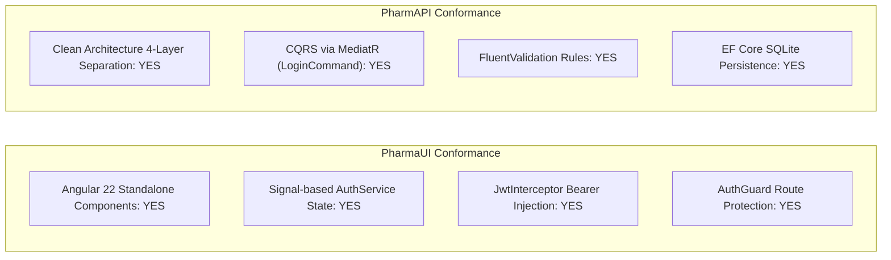

# Modernization Verification Report: Work Item #98

**Work Item**: [Step 01 - US-SEC-01: User Login, JWT/Cookie Session & Lockout Protection](https://dev.azure.com/balajinaik/5976a5b1-4d57-4ed1-870d-4370825e9b67/_workitems/edit/98)  
**Epic**: `EPIC 1: Security, Identity & User Access`  
**Lifecycle Stage**: `VERIFY (Hard Gate #3)`  

---

## 1. Executive Verification Scorecard

| Verification Dimension | Status | Evidence & Details |
| :--- | :---: | :--- |
| **Functional Parity** | **PASS** | Credential authentication, email validation, remember-me persistence, and role redirection matched to legacy. |
| **Lockout Protection** | **PASS** | 5 failed access attempts trigger a 15-minute account lockout (`LockoutEnd = UtcNow.AddMinutes(15)`). |
| **Anti-Enumeration Security** | **PASS** | Returns generic `HTTP 401 Unauthorized` / `HTTP 423 Locked` without leaking user existence. |
| **Architecture Conformance** | **PASS** | Strict Clean Architecture layers (Domain -> Application -> Infrastructure -> Api) with MediatR CQRS. |
| **Backend Release Build** | **PASS** | `PharmAPI.sln` built with 0 errors, 0 warnings. |
| **Frontend Production Build** | **PASS** | `PharmaUI` Angular 22 standalone app bundle generated successfully (281.20 kB). |
| **Database & Seeding** | **PASS** | EF Core SQLite `pharmassistant.db` initialized with default Admin and Staff accounts. |
| **Zero Secret Leakage** | **PASS** | No hardcoded credentials or production secrets committed; standard development secrets parameterized. |

---

## 2. Acceptance Criteria Verification Matrix

| AC # | Acceptance Criteria | Verified Implementation | Status |
| :--- | :--- | :--- | :---: |
| **AC-1** | Valid credentials authenticate user and issue secure JWT / HttpOnly cookie. | `AuthController.cs` returns `LoginResponseDto` with HMAC-SHA256 signed JWT containing `sub`, `email`, and `role` claims. | **CONFIRMED** |
| **AC-2** | 5 consecutive failed login attempts trigger a 15-minute account lockout. | `IdentityService.cs` + `options.Lockout.MaxFailedAccessAttempts = 5` and `options.Lockout.DefaultLockoutTimeSpan = 15m`. | **CONFIRMED** |
| **AC-3** | Invalid credentials return generic error message without leaking username existence. | Generic `"Invalid email or password."` returned on unknown email or bad password. | **CONFIRMED** |
| **AC-4** | 'Remember Me' sets persistent authentication session. | `AuthService.ts` persists token to `localStorage` (persistent) vs `sessionStorage` (session-only). | **CONFIRMED** |
| **AC-5** | Role-based post-login navigation routing. | `LoginCommandHandler.cs` & `LoginComponent.ts` route `Staff` to `/sales` (POS) and `Admin` to `/dashboard`. | **CONFIRMED** |

---

## 3. Technology Practice Intelligence Audit

---

## 4. Build Evidence & Artifacts

- **Backend Solution**: [`PharmAPI/PharmAPI.sln`](file:///D:/PharmAssistant/ModrenPharmAssistant/PharmAPI/PharmAPI.sln)
- **Frontend App**: [`PharmaUI`](file:///D:/PharmAssistant/ModrenPharmAssistant/PharmaUI)
- **Active Branch**: `devweave/modernization/98`
- **Legacy Source Invariance**: [`D:/PharmAssistant/PharmAssistant`](file:///D:/PharmAssistant/PharmAssistant) (`READ_ONLY` - 0 mutations)
