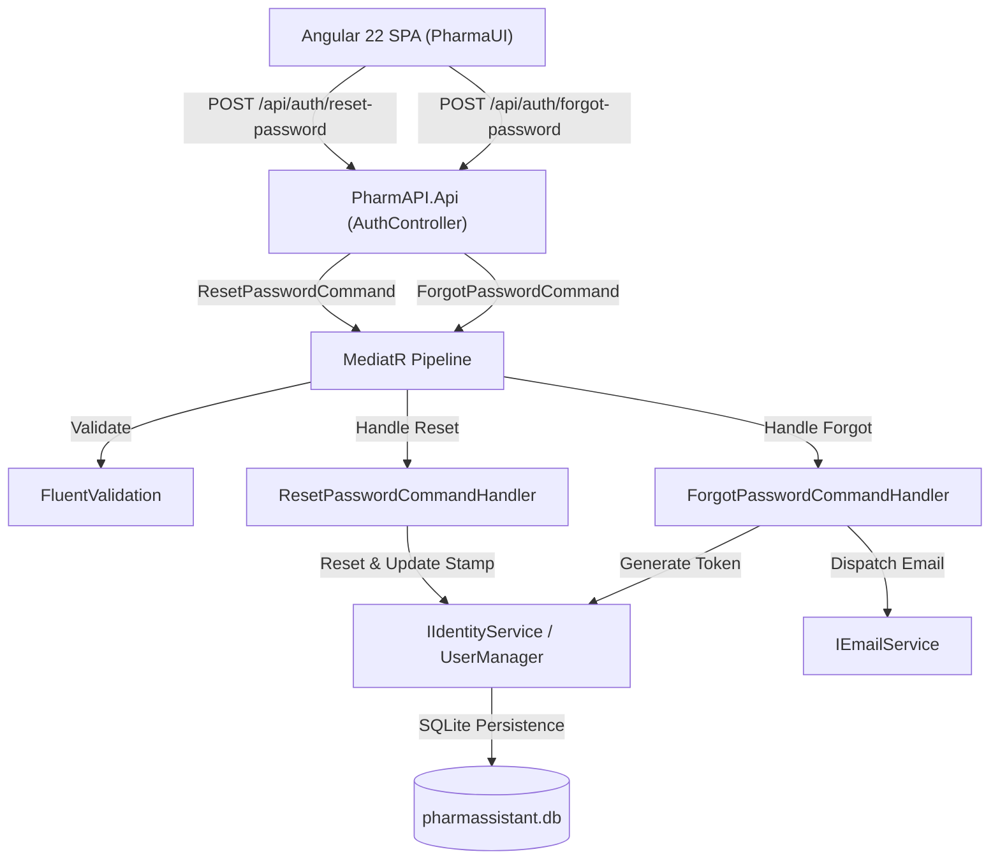

# Modernization Bounded Context: Work Item #100

**Work Item**: [Step 03 - US-SEC-03: Self-Service Password Recovery & Email Reset](https://balajinaik.visualstudio.com/5976a5b1-4d57-4ed1-870d-4370825e9b67/_apis/wit/workItems/100)  
**Epic**: `EPIC 1: Security, Identity & User Access`  
**Priority**: `2`  
**Status**: `CONTEXT_READY`  

---

## 1. Executive Summary & Objective

Modernize legacy ASP.NET MVC monolithic password recovery from [`AccountController.cs`](file:///D:/PharmAssistant/PharmAssistant/FYPPharmAssistant/Controllers/Account/AccountController.cs) (`ForgotPassword` and `ResetPassword` actions) and legacy Razor Views (`ForgotPassword.cshtml`, `ResetPassword.cshtml`) into:
1. **Backend**: Decoupled **ASP.NET Core 7.0 Web API** using the **CQRS pattern** via MediatR (`ForgotPasswordCommand`, `ResetPasswordCommand`), FluentValidation, and ASP.NET Core Identity with modern `IEmailService`.
2. **Frontend**: Decoupled **Angular 22 Standalone Components** (`ForgotPasswordComponent`, `ResetPasswordComponent`) with reactive forms, URL query token parsing, and feedback banners.

---

## 2. Legacy Source Slice (`READ_ONLY`)

### 2.1 Key Legacy Artifacts
- **Controller**: [`FYPPharmAssistant/Controllers/Account/AccountController.cs`](file:///D:/PharmAssistant/PharmAssistant/FYPPharmAssistant/Controllers/Account/AccountController.cs#L260-L340)
  - `ForgotPassword(ForgotPasswordViewModel model)`
  - `ResetPassword(ResetPasswordViewModel model)`
- **View Models**: [`FYPPharmAssistant/Models/Account/AccountViewModels.cs`](file:///D:/PharmAssistant/PharmAssistant/FYPPharmAssistant/Models/Account/AccountViewModels.cs)
  - `ForgotPasswordViewModel` (`Email`)
  - `ResetPasswordViewModel` (`Email`, `Password`, `ConfirmPassword`, `Code`)
- **Email Service**: [`FYPPharmAssistant/App_Start/IdentityConfig.cs`](file:///D:/PharmAssistant/PharmAssistant/FYPPharmAssistant/App_Start/IdentityConfig.cs#L88-L115) (`EmailService` calling SendGrid via `System.Net.Mail` / Web transport)
- **UI Views**:
  - `FYPPharmAssistant/Views/Account/ForgotPassword.cshtml`
  - `FYPPharmAssistant/Views/Account/ForgotPasswordConfirmation.cshtml`
  - `FYPPharmAssistant/Views/Account/ResetPassword.cshtml`
  - `FYPPharmAssistant/Views/Account/ResetPasswordConfirmation.cshtml`

### 2.2 Observed Legacy Behaviors & Business Rules
1. **Silent Existence Guard**: If an email is not registered or not confirmed, the system returns confirmation without leaking user existence (`Don't reveal that the user does not exist`).
2. **Cryptographic Token Generation**: `UserManager.GeneratePasswordResetTokenAsync(user.Id)` generates a cryptographically signed reset token.
3. **Password Update & Token Consumption**: `UserManager.ResetPasswordAsync(user.Id, model.Code, model.Password)` consumes the token and updates the password hash.
4. **Token Expiration**: Configured via token provider lifetime (24 hours).

---

## 3. Target Modernization Slice (`READ_WRITE`)

### 3.1 Backend Architecture ([`PharmAPI`](file:///D:/PharmAssistant/ModrenPharmAssistant/PharmAPI))

- **Application Layer (`PharmAPI.Application`)**:
  - `ForgotPasswordCommand(string Email)` : `IRequest<ForgotPasswordResponseDto>`
  - `ForgotPasswordCommandHandler` : Generates token, dispatches email via `IEmailService`, returns generic success response.
  - `ForgotPasswordCommandValidator` : FluentValidation checking valid email format.
  - `ResetPasswordCommand(string Email, string Token, string NewPassword)` : `IRequest<ResetPasswordResponseDto>`
  - `ResetPasswordCommandHandler` : Validates token, calls `IIdentityService.ResetPasswordAsync`, updates security stamp to invalidate old sessions.
  - `ResetPasswordCommandValidator` : FluentValidation enforcing password strength rules.
  - `IEmailService` : Interface for transactional email delivery.
- **Infrastructure Layer (`PharmAPI.Infrastructure`)**:
  - `IdentityService` updates: Implement `GeneratePasswordResetTokenAsync` and `ResetPasswordAsync`.
  - `EmailService` / `MockEmailService`: Concrete implementation logging or dispatching reset email links.
- **API Layer (`PharmAPI.Api`)**:
  - `[HttpPost("forgot-password")]` -> `ForgotPasswordCommand`
  - `[HttpPost("reset-password")]` -> `ResetPasswordCommand`

### 3.2 Frontend Architecture ([`PharmaUI`](file:///D:/PharmAssistant/ModrenPharmAssistant/PharmaUI))

- **Components**:
  - `ForgotPasswordComponent` (`src/app/features/auth/forgot-password/`): Standalone component with email input, loading state, success message banner.
  - `ResetPasswordComponent` (`src/app/features/auth/reset-password/`): Standalone component extracting `token` and `email` from query parameters (`ActivatedRoute`), new password + confirm password inputs, password strength validator, success banner, redirect to login.
- **Services**:
  - `AuthService.forgotPassword(email: string): Observable<any>`
  - `AuthService.resetPassword(data: ResetPasswordRequest): Observable<any>`
- **Routing**:
  - Add `{ path: 'forgot-password', component: ForgotPasswordComponent }`
  - Add `{ path: 'reset-password', component: ResetPasswordComponent }`

---

## 4. Acceptance Criteria & Verification Matrix

| # | Acceptance Criteria | Legacy Parity | Modern Verification Method |
| :--- | :--- | :--- | :--- |
| **AC-1** | Submitting valid email sends time-limited, single-use cryptographic reset token | `AccountController.ForgotPassword` + `UserManager.GeneratePasswordResetTokenAsync` | Handler test asserting `IEmailService.SendEmailAsync` received correct reset link with token |
| **AC-2** | Reset password link validates token expiration (24 hours) | `DataProtectorTokenProvider` lifetime | Unit test with expired/invalid token returning failure |
| **AC-3** | Resetting password updates password hash and revokes prior active sessions | `UserManager.ResetPasswordAsync` | Integration test asserting password change and updated `SecurityStamp` |
| **AC-4** | Email delivery integrated via modern email client | SendGrid in `IdentityConfig.cs` | `IEmailService` registered in DI and tested |

---

## 5. Technology Practice Constraints & Blast Radius

- **Security Rule**: Anti-enumeration protection — never reveal whether an email address exists in the system during forgot-password requests.
- **Session Revocation**: Ensure ASP.NET Identity updates `SecurityStamp` during password reset so old JWTs/refresh sessions are invalidated.
- **Clean Architecture**: `PharmAPI.Application` defines `IEmailService` and commands without coupling to concrete email SDKs.
