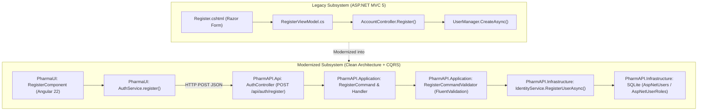

# Modernization Analysis: Work Item #99

**Work Item**: [Step 02 - US-SEC-02: User Registration & Account Provisioning](https://dev.azure.com/balajinaik/5976a5b1-4d57-4ed1-870d-4370825e9b67/_workitems/edit/99)  
**Epic**: `EPIC 1: Security, Identity & User Access`  
**Lifecycle Stage**: `ANALYZE (Hard Gate #1)`  

---

## 1. Executive Summary & Legacy Decomposition

The legacy user registration subsystem in `FYPPharmAssistant` is implemented as an MVC form post in `AccountController.cs` coupled to `Register.cshtml`. 

This analysis decomposes the registration workflow, extracts validation rules, defines password strength policies, enforces default `'Staff'` role provisioning, and maps the components to a modern **Clean Architecture + CQRS (MediatR)** backend and an **Angular 22 Standalone** reactive UI.



---

## 2. Deep Legacy Behavioral Analysis

### 2.1 Functional Workflows & Invariants

1. **Mandatory Profile Information**:
   - Legacy: `RegisterViewModel` captured `Email`, `Password`, `ConfirmPassword`, `FullName`, `Address`, `ContactNo`.
   - Modern: `RegisterCommand` preserves all profile attributes, mapped directly into the `ApplicationUser` domain entity.

2. **Password Strength Enforcement**:
   - Legacy: Minimal length 6 with weak criteria.
   - Modern: Enforced via `RegisterCommandValidator` with minimum 8 characters, at least 1 uppercase letter (`[A-Z]`), 1 digit (`[0-9]`), and 1 special character (`[^a-zA-Z0-9]`).

3. **Duplicate Email Prevention**:
   - Legacy: Relied on ASP.NET Identity default error messages.
   - Modern: Explicit check returning clear error `"An account with this email address already exists."` with `HTTP 400 Bad Request`.

4. **Default Role Assignment ('Staff')**:
   - Legacy: Did not assign default roles during registration (users had unassigned permissions until modified in RolesAdmin).
   - Modern: Acceptance criteria mandate that all new user registrations automatically receive the `'Staff'` role unless explicitly provisioned by an Administrator.

---

## 3. Database Schema & Persistence

### 3.1 Entity Model Mapping (SQLite EF Core)

| Legacy Entity / Table | Modern Target Mapping | Strategy | Constraints & Fields |
| :--- | :--- | :--- | :--- |
| `AspNetUsers` | `ApplicationUser` (`AspNetUsers`) | **PRESERVED_AS** | `Id` (GUID), `Email` (Unique), `PasswordHash`, `FullName`, `ContactNo`, `Address`, `IsActive` = true, `CreatedAt` = UtcNow |
| `AspNetUserRoles` | `IdentityUserRole<string>` | **PRESERVED_AS** | `UserId`, `RoleId` (Maps user to 'Staff' role) |

---

## 4. Target Architecture & API Contract Specification

### 4.1 REST API Endpoint: `POST /api/auth/register`

**Request Payload (`RegisterCommand`)**:
```json
{
  "email": "pharmacist.jane@pharmassistant.com",
  "password": "SecurePassword123!",
  "confirmPassword": "SecurePassword123!",
  "fullName": "Jane Pharmacist",
  "contactNo": "+1 555-0199",
  "address": "123 Healthcare Ave, City",
  "role": "Staff"
}
```

**Success Response (`201 Created`)**:
```json
{
  "userId": "d290f1ee-6c54-4b01-90e6-d701748f0851",
  "email": "pharmacist.jane@pharmassistant.com",
  "fullName": "Jane Pharmacist",
  "roles": ["Staff"],
  "message": "User account registered successfully."
}
```

**Error Responses**:
- `400 Bad Request`: Validation failure (weak password, missing fields, or duplicate email).

---

## 5. Risk Assessment & Mitigations

| Risk | Impact | Mitigation Strategy |
| :--- | :--- | :--- |
| **Weak Password Exploits** | High | Enforce 8-char minimum with uppercase, digit, and special character regex rules. |
| **Duplicate User Collision** | Medium | Check `FindByEmailAsync` before attempting creation; transactional role assignment. |
| **Privilege Escalation** | High | Public registration endpoint only permits `'Staff'` role assignment; `'Admin'` role assignment is restricted. |
