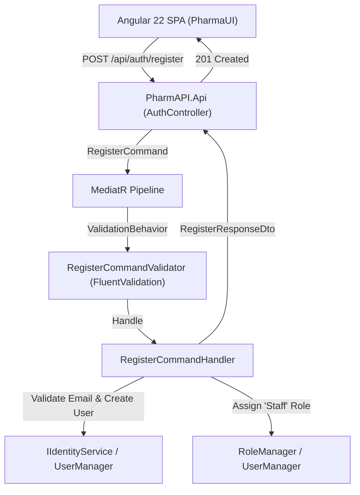

# Modernization Bounded Context: Work Item #99

**Work Item**: [Step 02 - US-SEC-02: User Registration & Account Provisioning](https://dev.azure.com/balajinaik/5976a5b1-4d57-4ed1-870d-4370825e9b67/_workitems/edit/99)  
**Epic**: `EPIC 1: Security, Identity & User Access`  
**Priority**: `2`  
**Status**: `CONTEXT_READY`  

---

## 1. Executive Summary & Objective

Modernize legacy monolithic user registration from [`AccountController.cs`](file:///D:/PharmAssistant/PharmAssistant/FYPPharmAssistant/Controllers/Account/AccountController.cs) (`Register` POST action) and Razor View [`Register.cshtml`](file:///D:/PharmAssistant/PharmAssistant/FYPPharmAssistant/Views/Account/Register.cshtml) into a decoupled **ASP.NET Core 7.0 Web API** using the **CQRS pattern** (`RegisterCommand`) and an **Angular 22 Standalone** registration component.

---

## 2. Legacy Source Slice (`READ_ONLY`)

### 2.1 Key Legacy Artifacts
- **Controller**: [`FYPPharmAssistant/Controllers/Account/AccountController.cs`](file:///D:/PharmAssistant/PharmAssistant/FYPPharmAssistant/Controllers/Account/AccountController.cs#L220-L243) (`Register` POST action)
- **View Models**: [`FYPPharmAssistant/Models/Account/AccountViewModels.cs`](file:///D:/PharmAssistant/PharmAssistant/FYPPharmAssistant/Models/Account/AccountViewModels.cs#L62-L90) (`RegisterViewModel`)
- **Domain & DB Context**: [`FYPPharmAssistant/Models/Account/IdentityModels.cs`](file:///D:/PharmAssistant/PharmAssistant/FYPPharmAssistant/Models/Account/IdentityModels.cs#L10-L25) (`ApplicationUser`: `FullName`, `Address`, `ContactNo`)
- **UI Template**: [`FYPPharmAssistant/Views/Account/Register.cshtml`](file:///D:/PharmAssistant/PharmAssistant/FYPPharmAssistant/Views/Account/Register.cshtml)

### 2.2 Observed Legacy Behaviors & Rules
1. **Fields Captured**: `Email`, `Password`, `ConfirmPassword`, `FullName`, `Address`, `ContactNo`.
2. **Account Creation**: `UserManager.CreateAsync(user, model.Password)`.
3. **Role Assignment**: Modern acceptance criteria require defaulting all new registrations to the `'Staff'` role.
4. **Validation**: Required fields, minimum password length, duplicate email checks.

---

## 3. Target Modernization Slice (`READ_WRITE`)

### 3.1 Backend Architecture ([`PharmAPI`](file:///D:/PharmAssistant/ModrenPharmAssistant/PharmAPI))

- **Application Layer (`PharmAPI.Application`)**:
  - `RegisterCommand(string Email, string Password, string FullName, string ContactNo, string Address, string? Role)` : `IRequest<RegisterResponseDto>`
  - `RegisterCommandHandler` : `IRequestHandler<RegisterCommand, RegisterResponseDto>`
  - `RegisterCommandValidator` : `AbstractValidator<RegisterCommand>` (Enforcing: Email format, required fields, password strength with min 8 chars, 1 uppercase, 1 digit, 1 special char).
  - `RegisterResponseDto` : `{ UserId, Email, FullName, Roles, Message }`
  - Abstraction: `IIdentityService.RegisterUserAsync`
- **Infrastructure Layer (`PharmAPI.Infrastructure`)**:
  - Update `IdentityService` to support `RegisterUserAsync` with duplicate email detection and default role assignment to `'Staff'`.
- **API Layer (`PharmAPI.Api`)**:
  - Expose `[HttpPost("register")]` in `AuthController.cs` returning `201 Created` or `400 Bad Request`.

### 3.2 Frontend Architecture ([`PharmaUI`](file:///D:/PharmAssistant/ModrenPharmAssistant/PharmaUI))

- **Models**: `RegisterRequest`, `RegisterResponse` in `auth.models.ts`.
- **Services**: `AuthService.register(request: RegisterRequest): Observable<RegisterResponse>`.
- **Components**: `RegisterComponent` (Standalone Angular 22 component) with reactive form, matching password validator, pharmacy branding, error alerts, and redirect to `/login` upon successful registration.
- **Routes**: `/register` path in `app.routes.ts`.

---

## 4. Acceptance Criteria & Verification Matrix

| # | Acceptance Criteria | Legacy Parity | Modern Verification Method |
| :--- | :--- | :--- | :--- |
| **AC-1** | Form validates required fields (Email, Password, FullName, ContactNo, Address) | `RegisterViewModel` validation | `RegisterCommandValidator` tests |
| **AC-2** | Password strength rules (min 8 chars, uppercase, digit, special character) are enforced | `IdentityConfig.cs` password policy | Validation regex / FluentValidation test |
| **AC-3** | Duplicate email registration is prevented with clear validation error | `UserManager.CreateAsync` duplicate check | Integration test asserting HTTP 400 with duplicate email error |
| **AC-4** | New users default to 'Staff' role unless created by Admin | Modern requirement | Assert user has 'Staff' role assigned in SQLite database |

---

## 5. Technology Practice Constraints & Blast Radius

- **Security**: Never return plain password hashes or internal entity models in response DTOs.
- **CQRS**: `RegisterCommand` executes user creation as a state-mutating command.
- **Clean Architecture**: `PharmAPI.Application` defines validation and orchestration without direct EF Core context coupling.
