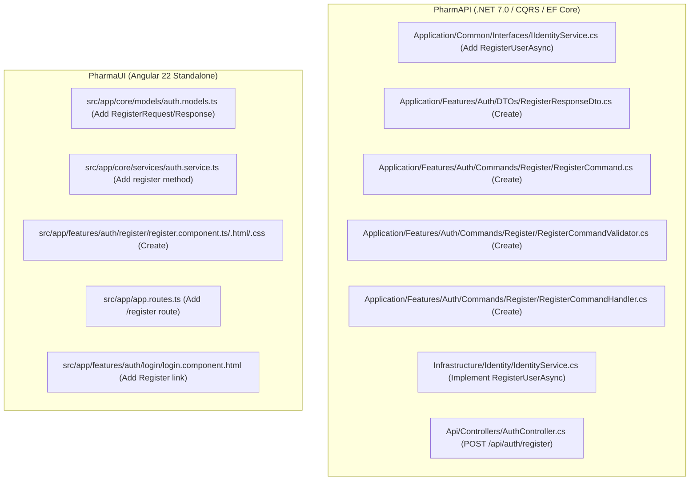

# Modernization Implementation Plan: Work Item #99

**Work Item**: [Step 02 - US-SEC-02: User Registration & Account Provisioning](https://dev.azure.com/balajinaik/5976a5b1-4d57-4ed1-870d-4370825e9b67/_workitems/edit/99)  
**Epic**: `EPIC 1: Security, Identity & User Access`  
**Lifecycle Stage**: `PLAN (Hard Gate #2)`  

---

## 1. Architectural File Execution Map



---

## 2. File-by-File Task Decomposition

### Phase A: Application Layer (`PharmAPI.Application`)

1. **Abstractions & DTOs**:
   - `MODIFY`: [`PharmAPI/PharmAPI.Application/Common/Interfaces/IIdentityService.cs`](file:///D:/PharmAssistant/ModrenPharmAssistant/PharmAPI/PharmAPI.Application/Common/Interfaces/IIdentityService.cs)
     - Add `RegisterUserAsync(string email, string password, string fullName, string contactNo, string address, string role = "Staff", CancellationToken cancellationToken = default);`
   - `CREATE`: [`PharmAPI/PharmAPI.Application/Features/Auth/DTOs/RegisterResponseDto.cs`](file:///D:/PharmAssistant/ModrenPharmAssistant/PharmAPI/PharmAPI.Application/Features/Auth/DTOs/RegisterResponseDto.cs)
     - Records: `UserId`, `Email`, `FullName`, `Roles`, `Message`.

2. **CQRS Command, Validator & Handler**:
   - `CREATE`: [`PharmAPI/PharmAPI.Application/Features/Auth/Commands/Register/RegisterCommand.cs`](file:///D:/PharmAssistant/ModrenPharmAssistant/PharmAPI/PharmAPI.Application/Features/Auth/Commands/Register/RegisterCommand.cs)
     - `public record RegisterCommand(string Email, string Password, string ConfirmPassword, string FullName, string ContactNo, string Address, string? Role = "Staff") : IRequest<RegisterResponseDto>;`
   - `CREATE`: [`PharmAPI/PharmAPI.Application/Features/Auth/Commands/Register/RegisterCommandValidator.cs`](file:///D:/PharmAssistant/ModrenPharmAssistant/PharmAPI/PharmAPI.Application/Features/Auth/Commands/Register/RegisterCommandValidator.cs)
     - Validates required fields, email format, password matching, and password strength (min 8 chars, 1 uppercase, 1 digit, 1 special character).
   - `CREATE`: [`PharmAPI/PharmAPI.Application/Features/Auth/Commands/Register/RegisterCommandHandler.cs`](file:///D:/PharmAssistant/ModrenPharmAssistant/PharmAPI/PharmAPI.Application/Features/Auth/Commands/Register/RegisterCommandHandler.cs)
     - Orchestrates user registration via `IIdentityService`, handles duplicate email errors, and returns `RegisterResponseDto`.

---

### Phase B: Infrastructure Layer (`PharmAPI.Infrastructure`)

3. **Identity Service Implementation**:
   - `MODIFY`: [`PharmAPI/PharmAPI.Infrastructure/Identity/IdentityService.cs`](file:///D:/PharmAssistant/ModrenPharmAssistant/PharmAPI/PharmAPI.Infrastructure/Identity/IdentityService.cs)
     - Implement `RegisterUserAsync`: checks for duplicate email, creates `ApplicationUser`, assigns `'Staff'` role, and handles Identity errors.

---

### Phase C: API Presentation Layer (`PharmAPI.Api`)

4. **Endpoint Exposure**:
   - `MODIFY`: [`PharmAPI/PharmAPI.Api/Controllers/AuthController.cs`](file:///D:/PharmAssistant/ModrenPharmAssistant/PharmAPI/PharmAPI.Api/Controllers/AuthController.cs)
     - Expose `[HttpPost("register")]` returning `201 Created` with `RegisterResponseDto` or `400 Bad Request`.

---

### Phase D: Frontend Layer (`PharmaUI`)

5. **Models & Services**:
   - `MODIFY`: [`PharmaUI/src/app/core/models/auth.models.ts`](file:///D:/PharmAssistant/ModrenPharmAssistant/PharmaUI/src/app/core/models/auth.models.ts)
     - Add `RegisterRequest` and `RegisterResponse` interfaces.
   - `MODIFY`: [`PharmaUI/src/app/core/services/auth.service.ts`](file:///D:/PharmAssistant/ModrenPharmAssistant/PharmaUI/src/app/core/services/auth.service.ts)
     - Add `register(request: RegisterRequest): Observable<RegisterResponse>` method.

6. **Register Component & Routing**:
   - `CREATE`: [`PharmaUI/src/app/features/auth/register/register.component.ts`](file:///D:/PharmAssistant/ModrenPharmAssistant/PharmaUI/src/app/features/auth/register/register.component.ts)
   - `CREATE`: [`PharmaUI/src/app/features/auth/register/register.component.html`](file:///D:/PharmAssistant/ModrenPharmAssistant/PharmaUI/src/app/features/auth/register/register.component.html)
   - `CREATE`: [`PharmaUI/src/app/features/auth/register/register.component.css`](file:///D:/PharmAssistant/ModrenPharmAssistant/PharmaUI/src/app/features/auth/register/register.component.css)
   - `MODIFY`: [`PharmaUI/src/app/app.routes.ts`](file:///D:/PharmAssistant/ModrenPharmAssistant/PharmaUI/src/app/app.routes.ts) (Add `/register` route).
   - `MODIFY`: [`PharmaUI/src/app/features/auth/login/login.component.html`](file:///D:/PharmAssistant/ModrenPharmAssistant/PharmaUI/src/app/features/auth/login/login.component.html) (Add register navigation link).

---

## 3. Verification Commands

```powershell
# 1. Build & verify backend solution
dotnet build D:\PharmAssistant\ModrenPharmAssistant\PharmAPI\PharmAPI.sln

# 2. Build frontend application
cd D:\PharmAssistant\ModrenPharmAssistant\PharmaUI ; npm run build
```
