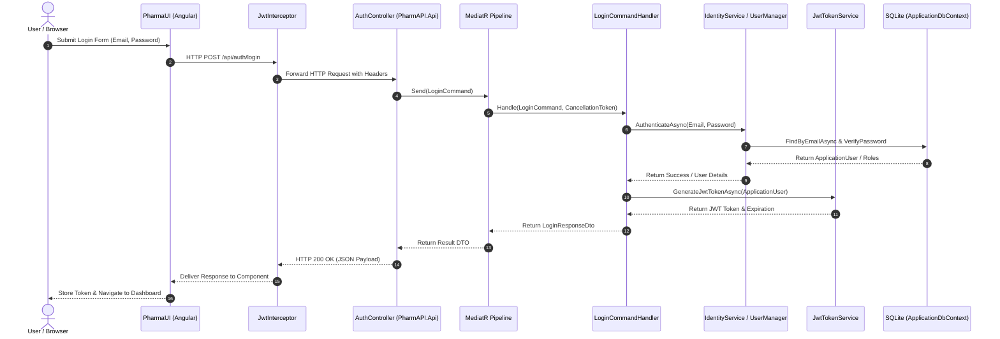

# Concrete End-to-End Request Flow

## Request Flow Sequence

## Detailed Pipeline Phases
1. **Frontend Initiation**:
   - `LoginComponent` captures credentials via reactive form `FormGroup`.
   - Dispatches call to `AuthService.login()`.
2. **HTTP Pipeline & Middleware**:
   - ASP.NET Core receives HTTP request.
   - `UseCors("AllowAngularApp")` verifies allowed origins (`http://localhost:4200`).
   - `UseAuthentication()` and `UseAuthorization()` evaluate security policies.
3. **Controller to Mediator**:
   - `AuthController.Login([FromBody] LoginCommand command)` delegates execution to MediatR pipeline via `ISender.Send(command)`.
4. **Application CQRS Execution**:
   - `LoginCommandHandler` processes the command.
   - Invokes `IIdentityService` abstraction.
5. **Infrastructure & Persistence**:
   - `IdentityService` interacts with `UserManager<ApplicationUser>` backed by `ApplicationDbContext` (SQLite).
   - Generates signed JWT security tokens using `IJwtTokenService`.
6. **Response Serialization**:
   - Result wrapped in `LoginResponseDto` returned through HTTP 200 OK JSON response.
